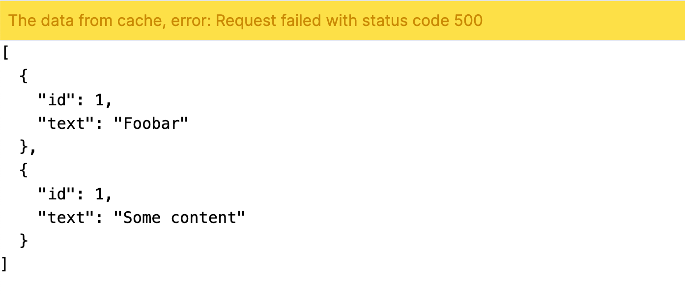

# 3 Tips make Next.js App More Stable

Since Next.js add `App Router` feature, we have `React Server Component`(`RSC`).

`RSC` can make your app rendering on server side, then return static HTML to browser.

Here is an example: **We write a page to render data that fetched from API**:

```ts
// app/page.tsx
export default async function HelloPage() {
  const data = await fetch('http://127.0.0.1:3068/messages', {cache: 'no-cache'}).then((res) =>
    res.json()
  );

  return <div>{JSON.stringify(data)}</div>
}
```

> Note: Add `{cache: 'no-cache'}` to disable cache for our testing purpose

The idea here is: What if the API error, and we will get an crashed page:


The API example code with express.js:

```ts
import express from 'express';

const app = express();

app.use(express.urlencoded({ extended: true }));
app.use(express.json());

app.get('/', (req, res) => {
  res.send('hi');
});

app.get('/messages', (req, res) => {
  const isEven = Math.round(Math.random() * 19) % 2 === 0;
  if (isEven) {
    res.send([
      { id: 1, text: 'Foobar' },
      { id: 1, text: 'Some content' },
    ]);
  } else {
    res.status(500).send({
      msg: 'some error happend',
    });
  }
});

app.listen(3068, () => {
  console.log(`Server listening at: http://127.0.0.1:3068`);
});
```

So what can be improved here? We can:

1. At least to retry if API have error;

2. Cache data when API request success, and use the cached data if API retried but still error;

3. Another additional: Dedupe the requests;

You can write addons for fetch, or use axios with axios plugins to do this;

Here I use a lib called [`xior`](<[https](https://www.npmjs.com/package/xior)>) to do these improvements, the `xior` lib's API similar to `axios` and use built-in `fetch`:

Install xior first:

```sh
npm install xior

# or pnpm install
pnpm install xior
```

Create instance and use the plugins:

```ts
// app/http.ts
import xior from 'xior';
import errorRetryPlugin from 'xior/plugins/error-retry';
import errorCachePlugin from 'xior/plugins/error-cache';
import dedupeRequestPlugin from 'xior/plugins/dedupe';

export const http = xior.create({
  baseURL: 'http://127.0.0.1:3068/',
});

http.plugins.use(
  errorRetryPlugin({
    retryTimes: 2,
    retryInterval(count) {
      return count * 250;
    },
    onRetry(config, error, count) {
      console.log(`${config?.method} ${config?.url} retry ${count}`);
    },
  })
);
http.plugins.use(errorCachePlugin());
http.plugins.use(dedupeRequestPlugin());
```

And we create another page `app/improved/page.tsx` to use the code:

```tsx
// app/improved/page.tsx
import { http } from '../http';

export default async function ImprovedHelloPage() {
  const { data, fromCache, error } = await http.get('/messages', { cache: 'no-cache' });

  return (
    <div>
      {fromCache ? (
        <>
          <div className="p-2 text-yellow-600 bg-yellow-300">
            The data from cache, error: {error?.message}
          </div>
          <hr />
        </>
      ) : null}
      <pre>{JSON.stringify(data, null, 2)}</pre>
    </div>
  );
}
```

So when have error happend and even retried still error, but the page will not crash:



Example source code: https://github.com/suhaotian/3-tips-make-next-more-stable-demo
